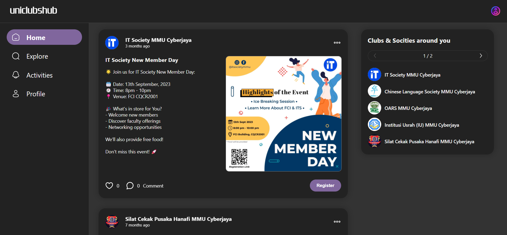

## About Uniclubshub 

A final year project that aims to develop a web-based system to assist and enhance the engagement with student clubs and societies at the university. The system is built using React.js for the frontend and utilizes Node.js, Express.js and MySQL for the backend.

The main concept of the application is to create a social media platform experience, with a specific focus on engaging the audience of university clubs and societies. The application brief walkthrough is [here](https://drive.google.com/file/d/1lPH2ncrjKvKC9rpyTWJYPwf1tQbqSkOd/view?usp=sharing).



## Key Features

- Have 2 roles (club and participant)
- Personalized user profiles for both roles
- Post events and share updates about the club info
- Like, comment, and share posts 
- Follow and unfollow preferred interest clubs
- Real-time notifications via Socket.IO
- View account activities
- Event registration in the system with downloadable participant list
- Discover all clubs and events available in the system

## Deployment

Currently, the deployed backend may spin down due to inactivity as it is a part of a free tier service subscription. Thus, The deployed application cannot be accessed unless a request is made. 

## Getting Started in Local

First, in client folder, run the client development:

```bash
npm run dev
```

Then, in server folder, run the server development:

```bash
npm start
```
